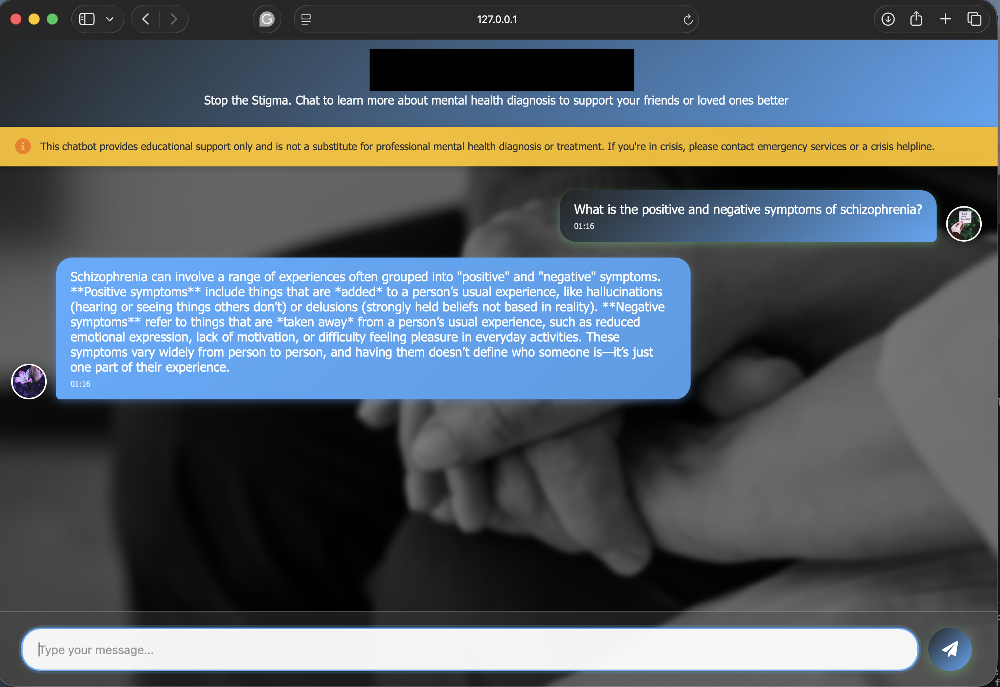
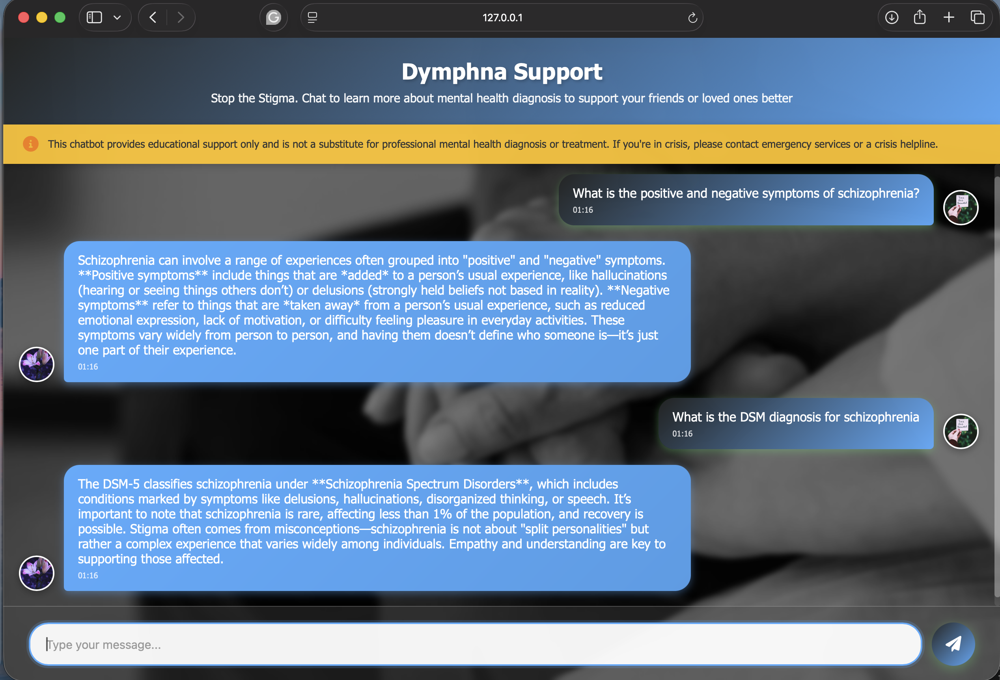

# Stigma Reduction Chatbot - Understanding Mental Health Together

<div align="center">


*Your compassionate companion for understanding mental health*

[](https://opensource.org/licenses/MIT)
[](https://www.python.org/downloads/)
[](https://flask.palletsprojects.com/)

</div>

---

## 📖 Introduction

**Stigma Reduction Chatbot** is an educational mental health companion designed to help caregivers, family members, friends, and community members better understand people living with mental health disorders. This chatbot aims to reduce stigma and foster compassion in our communities.

### 🎯 Purpose

This tool serves to:
- Help caregivers understand why individuals with mental health conditions may behave in certain ways
- Provide evidence-based knowledge about mental health disorders
- Equip supporters with information to offer better care and understanding
- Foster empathy and reduce stigma surrounding mental health
- Create a kinder, more compassionate world for people with mental health disabilities

### ⚠️ **IMPORTANT DISCLAIMER**

> **THIS CHATBOT IS NOT FOR DIAGNOSIS OR TREATMENT**
> 
> Stigma Reduction Chatbot is an **educational tool only** and should **NEVER** replace professional mental health care. It is designed for learning and understanding, not for:
> - Diagnosing mental health conditions
> - Providing treatment or therapy
> - Offering medical advice
> - Replacing psychiatrists, clinical psychologists, or licensed therapists
> 
> If you or someone you know is experiencing a mental health crisis, please seek immediate professional help.

---

## 🆘 Crisis Support Resources (Malaysia)

If you or someone you know is in distress, please reach out for immediate help:

| Organization | Contact | Operating Hours |
|--------------|---------|-----------------|
| **Befrienders KL** | [Visit Website](https://www.befrienders.org.my/) | 24/7 |
| **Talian HEAL** | 15555 | 24/7 |
| **Shalom Careline** | 03-2723 7272 |  10.00am to 1.00pm & 7.00pm to 11.00pm (Daily)  |
| **Mitra Line (Thang Hsiang Temple)** | 03-7981 5301 / 03-7981 5300 | Daily: 7pm-10pm |
| **Lifeline Association Malaysia** | 03-4265 7995 | Mon-Fri: 7:30pm-10pm<br>Sun: 2pm-5pm |
| **Buddhist Gem Fellowship (BGF)** | 011-5994 4384 / 011-2528 9610 | Mon-Fri: 7pm-10pm |
| **All Women's Action Society (AWAM)** | 03-7877 0224 | Mon-Fri: 9am-5pm |

**In case of emergency, visit the nearest hospital emergency department or call 999.**

---

## 🖼️ Screenshots

<div align="center">

### Chat Interface



</div>

---

## 🎓 Data Source & Attribution

**Knowledge Base:**  
📚 [Fundamentals of Psychological Disorders - 3rd Edition](https://open.umn.edu/opentextbooks/textbooks/890) by Alexis Bridley & Lee W. Daffin Jr. (Washington State University, 2022)

**Images:** Pexels - [Fotios Photos](https://www.pexels.com/@fotios-photos/), [Pavel Danilyuk](https://www.pexels.com/@pavel-danilyuk/), [Erik Archaga](https://www.pexels.com/@erikarchaga/)

**Guidance:** [DS with Bappy](https://www.youtube.com/@dswithbappy)

---

## 🛠️ Tech Stack

This project leverages cutting-edge AI and web technologies:

- **🤖 LLM:** Mistral (via OpenRouter)
- **🔗 Framework:** LangChain
- **📊 Vector Database:** Pinecone
- **🌐 Web Framework:** Flask
- **☁️ Future Deployment:** Azure
- **🎨 Frontend:** HTML, CSS, JavaScript

---

## 🚀 Getting Started

### Prerequisites

- Python 3.8 or higher
- Git
- Pinecone account
- OpenRouter API key

### Installation Steps

1. **Clone the repository**
   ```bash
   git clone https://github.com/juinnsheng/abnpsychchatbot.git
   cd abnpsychchatbot
   ```

2. **Activate virtual environment**
   ```bash
   source .venv/bin/activate
   ```

3. **Create environment file**
   
   Create a `.env` file in the root directory with your API keys:
   ```plaintext
   PINECONE_API_KEY="your_pinecone_api_key_here"
   openrouter_api_key="your_openrouter_api_key_here"
   ```

4. **Index the knowledge base**
   ```bash
   python store_index.py
   ```

5. **Run the application**
   ```bash
   python app.py
   ```

6. **Open your browser**
   
   Navigate to `http://localhost:5000`

---

## 💡 How It Works

1. **Knowledge Retrieval:** The chatbot uses Pinecone vector database to store and retrieve relevant information from the mental health textbook
2. **Context Understanding:** LangChain orchestrates the conversation flow and maintains context
3. **Natural Responses:** Mistral LLM generates compassionate, evidence-based responses
4. **User Interface:** Flask serves a clean, intuitive web interface for easy interaction

## 📄 License

This project is licensed under the Apache 2.0 License - see the LICENSE file for details.

---

## 💭 Our Mission

**The world needs to be kinder to people with mental health disabilities.**

Through understanding comes compassion. Through compassion comes support. Through support comes healing.

Stigma Reduction Chatbot is our small contribution to creating a more understanding and supportive world for everyone affected by mental health challenges.

---

## 🙏 Acknowledgments

- Washington State University for the open educational resource
- The Pexels photography community
- All mental health professionals and advocates working to reduce stigma
- You, for taking the time to learn and understand

---

<div align="center">

</div>
